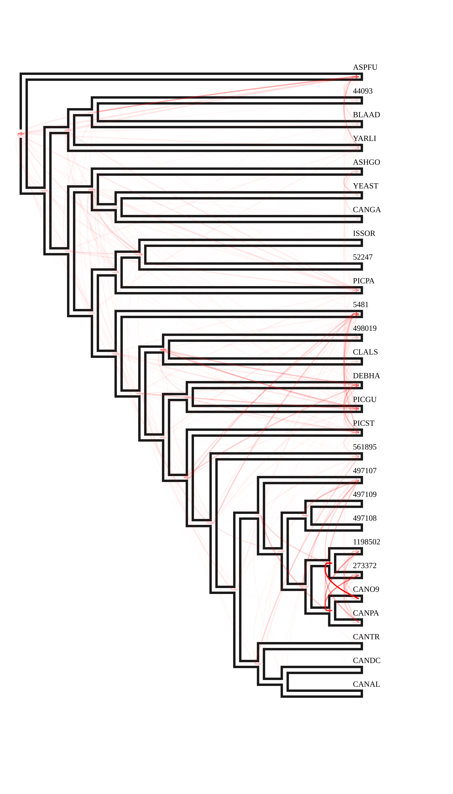

- [Gene-tree Species tree Reconciliation](#gene-tree-species-tree-reconciliation)
  - [Input](#input)
  - [Pipeline](#pipeline)
  - [Results](#results)

# Gene-tree Species tree Reconciliation

## Input

Species tree should not have support values as they will be considered as internal node labels!
You can remove them with `nw_topology -b -I sptree > sptree.out`

## Pipeline

## Results

